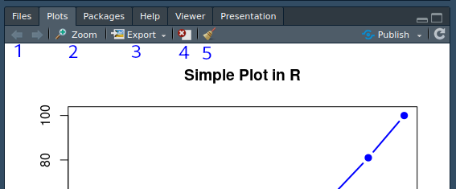

**Versão**: 1.0.0<br />

# Introdução ao R
## Histórico da linguagem
John Chambers iniciou a criação de um ambiente de análises estatísticas em 1976 no *Bell Telephone Laboratories*, também conhecido como *Bell Labs*. Naquela época a computação estatística costumava ser feita por meio de chamadas diretas às funções de bibliotecas Fortran, e tal ambiente foi projetado para oferecer uma abordagem alternativa, mais interativa, e com funções de documentação acessível. Este ambiente foi denominado de 'S' e após 1979 o nome passou a ser usado sem as aspas simples.

Em 1988 foi lançada a versão S3, muitas mudanças foram feitas na sintaxe da linguagem, estendendo o conceito de objetos, e novas funcionalidades possibilitavam a passagem de funções para outras funções, como o uso do `apply`. Foi publicado o livro The *New S Language* para introduzir as novas funcionalidades e ajudar os usuários a entender como os códigos deveriam ser escritos.

A linguagem R foi criada em 1991, como uma variante da linguagem S, por Ross Ihaka e Robert Gentleman no Departamento de Estatística da Universidade de Auckland, e foi anunciada para o público em 1993. Neste mesmo ano, a *Bell Labs* concedeu uma licença exclusiva à *StatSci*, que posteriormente virou a *Insightful Corporation*, para desenvolver e vender a linguagem S. A *Insightful Corporation* adicionou algumas funcionalidades à linguagem, como a adição de uma interface gráfica, e vendia esta implementação como o produto *S-PLUS*.

Uma das limitações da linguagem S era que ela só estava disponível no pacote comercial S-PLUS, e em 1995, Martin Mächler convenceu Ross e Robert a usarem a *GNU General Public License*, tornando o R um software livre. Em 1998 foi lançada a última versão da linguagem S, conhecida como S4, que fornecia funcionalidades avançadas de orientação a objetos.
Em 2000 a versão 1.0.0 da linguagem R foi lançada publicamente. E em 2008 a *TIBCO Software Incorporation* adquiriu a *Insightful Corporation* por 25 milhões de dólares.

## Instalação do R
O interpretador da linguagem R pode ser instalado em Linux, Mac e Windows^[os passos necessários para a instalação podem ser diferentes de acordo com o sistema operacional utilizado], e encontra-se disponível gratuitamente no [Comprehensive R Archive Network (CRAN)](https://cran.r-project.org/).

## RStudio
O RStudio é um ambiente de desenvolvimento integrado que inclui console, editor ciente de sintaxe e diversas outras ferramentas, que visam o aumento da produtividade do desenvolvedor. Possui edições gratuitas e comerciais, que podem ser obtidas em [RStudio.com](https://www.rstudio.com/products/rstudio/).

## Funcionamento básico

### Operadores

* Aritméticos
```{r}
# adição
2+5         
# subtração
5-2         
# multiplicação
2*5         
# divisão
8/2         
# exponenciação
2^5
2**5
# resto da divisão
5%%2
```

* Relacionais
```{r}
# igual
3==5	      
# diferente
3!=5	      
# maior que
3>5	      
# menor que
3<5	      
# maior ou igual
3>=5	      
# menor ou igual
3<=5	      
```

Operações podem ser concatenadas:
```{r}
((2+5-3)*10)^4/7^4
```

### Variáveis

Atribuição de valores:
```{r}
x <- 1
# sobrescreve o conteúdo anterior da variável x
x <- 5
y <- "gol do Grêmio"
```

Exibindo conteúdo de variáveis:
```{r}
x
y
```

Armazenando o resultado de operações:
```{r}
x<-2+5
y=5-2
2*5->w
z<-8/2

resultado <- (((x-y)*w)^z)/(x^z)
resultado
```

### Funções

Chamando funções:
```{r}
sum(1,3,5)
a<-rep("Aluno",times=3)
a
```

### Acessando a documentação
Estas funções buscam e exibem a documentação de funções:
```{r eval=FALSE}
help(sum)
?sd
??plot
```

### Diretório de trabalho

Estas funções manipulam o diretório de trabalho:
```{r eval=FALSE}
# verifica o caminho para o diretório de trabalho
getwd()
# define o diretório de trabalho
setwd()
# lista os arquivos presentes no diretório de trabalho
list.files()
# carrega um arquivo binário do diretório de trabalho para o ambiente
load()
# salva o conteúdo de uma variável no diretório de trabalho
save()
```

# Objetos em R
## Vetores
Função de concatenação `c()`:
```{r}
number<-c(1, 2, 3, 4, 5)
letter<-c("x", "y", "z", "w", "j")
logico<- c(TRUE, FALSE, FALSE, TRUE, FALSE)
seq<-1:10
complexo<-4i
```

A função `class()` pode ser usada para acessar a classe de um determinado objeto:
```{r}
class(number)
```

A função `vector()` cria vetores com valores padrões de uma determinada classe:
```{r eval=FALSE}
a<-vector(mode = "integer", length = 10)
b<-vector("logical", 10)
c<-numeric(10)
d<-character(10)
e<-complex(10)
```

Números são salvos como `numeric` por padrão:
```{r}
x <- 1
class(x)
```

Para explicitar o tipo `integer` usa-se L como sufixo do número:
```{r}
x <- 1L
class(x)
```

### Hierarquia de classes
Vetores comportam apenas uma classe de elementos. Quando um vetor é criado com valores pertecentes a classes distintas, é feita uma conversão implícita. Um valor `logical` é convertido para `numeric`, e um valor `numeric` é convertido para `character`:
```{r}
class(c(1, 2, 3))
class(c("1", "2", "3"))
class(c(TRUE, FALSE, FALSE))
class(c("TRUE", "FALSE", "FALSE"))
class(c(1, "a", TRUE))
class(c(1, "a"))
class(c(1, T))
class(c("a", T))
```

Com esta hierarquia, é possível somar valores lógicos, sendo `TRUE` equivalente a 1^[na conversão de valores numéricos para lógicos, 0 é convertido para FALSE e qualquer outro valor é convertido em TRUE], e `FALSE` equivalente a 0:
```{r}
logical<- c(TRUE, FALSE, FALSE, TRUE, FALSE)
sum(logico)
```

Uma conversão explícita pode ser feita com as funções `as.<nome da classe>`:
```{r}
x<-0:10
x
class(x)
a<-as.numeric(x)
a
class(a)
b<-as.character(x)
b
class(b)
c<-as.logical(x)
c
class(c)
```

### Valores não disponíveis ou impossíveis
Valores não disponíveis são representados por `NA` (*Not Available*), e valores impossíveis, como o resultado de uma divisão por 0, são representados por `NaN` (*Not a Number*).
```{r}
x<-c(1, 2, 3, NA)
y<-c("a", "b", "c", NA)
is.na(x)
w<-rep(NA, 10)
w
class(w)
z<-rep(NA_integer_, 10)
z
class(z)
a <- c(1, 3, NA, 7, 9)
sum(a)
sum(a, na.rm=TRUE)
```

### Atributos de objetos
Todos os objetos possuem atributos:
```{r}
x<-1:5
x
length(x)
dim(x)
attributes(x)
names(x)<-c("a", "b", "c", "d", "e")
x
attributes(x)
```

### Fator
Um vetor da classe `factor` é um vetor categórico que possui o atributo `levels`:
```{r}
x<-factor(c("s", "n", "n", "s", "s"))
z<-factor(c("alto", "baixo", "medio"))
x
z
```

### Trabalhando com vetores
No R as operações são vetorizadas:
```{r}
x<-1:5
x
y<-6:10
y
# soma dos valores de ambos os vetores
x+y
# podemos multiplicar um vetor por um número
x*2               
x^2
z<-c(x,y)
z
z+x
w<-1:3
w+x
l<-c(T, T, F, T, F, F)
l/2
```

Usamos `[]` para acessar elementos de vetores:
```{r}
letter<-c("x", "y", "z", "w", "j")
# acessa o segundo elemento do vetor
letter[2]               
# podemos usar sequências de valores
letter[2:4]             
# usamos a função c() para valores não contíguos
letter[c(1, 4)]         
#usamos números negativos para excluir um ou mais valores
letter[-2]              
letter[c(-2, -5)]
#podemos criar índices numéricos
idx<-c(1, 4)            
letter[idx]
x<-1:10
# podemos usar operadores relacionais como filtros
x[x>7]                  
# também funciona com caracteres, levando em consideração a ordem lexicográfica
letter[letter>"k"]      
letter[letter<"k"]
letter=="z"
```

Funções para identificar valores extremos:
```{r}
# definindo uma semente para a geração de valores aleatórios
set.seed(1)
s<-sample(-1000:1000, 200)
# procura a posição do maior valor
which.max(s)            
# exibe o maior valor
max(s)
# exibe o menor valor
min(s)
# exibe o intervalo dos valores do vetor
range(s)
# cria um vetor lógico
s>0                     
# cria um vetor com as posições que satisfazem o comando
which(s>0)              
```

Funções de ordenamento:
```{r}
x<-c(3, 8, 2, 1, 5, 9, 7, 7, 3)
x
# ordena um vetor
sort(x)        
sort(x, decreasing = T)
# informa a ordem na qual cada elemento deve ser acessado para exibir o conteúdo do vetor em ordem crescente
order(x)                
# exibe o conteúdo do vetor de forma aleatória, e uma única vez, cada posição
sample(x)     
# elimina as replicatas
unique(x)
# exibe um vetor lógico referente à posição das replicatas
duplicated(x)           
```

## Matrizes
Matrizes são vetores bidimensionais que possuem o atributo dimensão. Por serem vetores, comportam apenas uma classe de elementos:
```{r}
x<-1:20
x
attributes(x)
m<-matrix(x, 4, 5)
m
attributes(m)
dim(x)<-c(4,5)
x
identical(x, m)
a<-1:5
b<--1:-5
c<-c(3, 6, 4, 9, 1)
# a função cbind() concatena colunas
m<-cbind(a, b, c)       
m
# a função rbind() concatena linhas  
m1<-rbind(a, b, c)
m1
# elementos são acessados pelos índices das duas dimenções [linha, coluna]
m[1,3]
# toda a linha
m[1, ]
m[2:3, ]
# atribuição
m[1,]<-NA
m
```

## Arrays
Um `array` é um vetor que possui mais de duas dimensões:  
```{r}
# criando um vetor multidimensional com 4 matrizes de 5 linhas e 10 colunas
ar<-array(1:200, c(5, 10, 4))
ar
# acessando a primeira matriz [linha, coluna, matriz]
ar[,,1]                          
```

## Strings
Conceitualmente, uma `string` é um vetor de caracteres^[independente da quantidade de caracteres o atributo length será sempre igual a 1]. Certas operações são recorrentes na manipulação de strings, como a inserção de conteúdo numa dada posição, substituição do conteúdo de uma porção do vetor, ou a busca de um determinado padrão:

```{r}
x<-20:30
y<-1:4
# adiciona valores num vetor numa posição específica
append(x, y, after = 3)
# concatena dois vetores, converte em character
x<-paste("dt", 1:10, sep = "")     
x
```
Identificando expressões regulares (regex) numa string:
```{r}
x <- c("16_24cat", "25_34cat", "35_44catch", "45_54Cat", "55_104fat")
# identifica regex por posição
grep("cat", x)               
# o argumento value = T retorna os valores
grep("cat", x, value = T)           
# $ é um metacaractere que identifica o término da string
grep("cat$", x, ignore.case = T)    
# a função grepl() retorna um vetor lógico
grepl("cat$", x, ignore.case = T)
``` 

### Expressões regulares
Metacaractere | Funcionalidade
--------------|---------------
*             | 0 ou mais vezes
+             | uma ou mais vezes
?             | 0 ou 1 vez
{n}           | exatamente n vezes
{n,}          | pelo menos n vezes
{n,m}         | entre n e m vezes
^             | início da string
$             | final da string

```{r}
strings <- c("a", "ab", "acb", "accb", "acccb", "accccb")
grep("acb", strings)
grep("ac*b", strings)
grep("ac+b", strings)
grep("ac?b", strings)
grep("ac{2}b", strings)
grep("ac{2,}b", strings)
grep("ac{2,3}b", strings)
```

## Listas
Listas são tipos especiais de vetores que comportam elementos de diferentes classes:
```{r}
a <- c(1, 3, NA, 7, 9)
b<-matrix(1:200, 20,10)
c<-"Gol do Gremio"
z<-factor(c("alto", "baixo", "medio"))
ls<-list(a, b, c, z)
# cada elemento da lista aparece com [[]]
ls                    
# a função vector() pode criar listas vazias
ls1<-vector("list", 5)   
ls1
```

### Trabalhando com listas
Listas podem ser acessadas com os operadores `[]`, `[[]]` e `$` (para listas nomeadas):
```{r}
# [] extrai uma lista
ls[1]        
# [[]] extrai o objeto interno
ls[[1]]           
class(ls[1])
class(ls[[1]])
# posição na lista e posição no elemento
ls[[c(1,2)]]      
ls[[2]][2,]
names(ls)<-c("Arilson", "Roger", "Paulo Nunes", "Jardel")
ls$Roger
```

## Data.frames
Um `data.frame` é um tipo especial de lista, onde todos os elementos devem possuir o mesmo length. Por ser uma lista, cada posição comporta elementos de diferentes classes. Do ponto de vista prático, o `data.frame` funciona como uma planilha bidimensional formado por vetores de mesmo tamanho, sendo cada vetor uma coluna:
```{r}
number<-c(1, 2, 3, 4, 5)
letter<-c("x", "y", "z", "w", "j")
logical<- c(TRUE, FALSE, FALSE, TRUE, FALSE)
seq<-1:10
dt<-data.frame(number, letter, logical)
class(dt)
# usamos $ para acessar as colunas de um data.frame
dt$letter               
# vetores de caracteres são interpretados como fatores
class(dt$letter)          
# argumento stringsAsFactors = F altera este comportamento padrão
dt<-data.frame(number, letter, logical, stringsAsFactors = F) 
dt$letter
class(dt$letter)
# data.frames possuem colnames e rownames como atributos
attributes(dt)                
colnames(dt)
row.names(dt)
# acessamos data.frames da mesma forma que matrizes
dt[5,2]                       
```

### Trabalhando com data.frames
Para acessar data.frames podemos usar os operadores `[]`, `[[]]` e `$`:
```{r}
dt<-data.frame(number=c(1, 2, 3, 4, 5),
               letter = c("x", "y", "z", "w", "j"),
               logical = c(TRUE, FALSE, FALSE, TRUE, FALSE))
# [[ ]] acessa cada coluna por posição
dt[[1]]              
# [ ] acessa as coordenadas [linha, coluna]
dt[,1]               
# $ acessa a coluna pelo nome
dt$number            
# carrega o data.frame mtcars
cars<-mtcars        
# mostra as 6 primeiras linhas
head(cars)          
# mostra as 6 ultimas linhas
tail(cars)
# data.frames possuem colnames e rownames
colnames(dt)
row.names(dt)
# podemos alterar colnames e rownames
row.names(dt)<-c("a", "b", "c", "d", "e")
# alterando apenas a posição 2
colnames(dt)[2]<-"letras"     
# podemos alterar valores específicos de um data.frame
dt[3,1]<-"10"
dt$logical<-as.numeric(dt$logical)
dt$letras<-NA
```

É possível verificar as ocorrencias de um data.frame em outro:
```{r}
biometria<-data.frame(nomes=c("Carlos", "Roberto", "Olivio", "Joel"),
                      altura=c(180, 187, 155, 168),
                      peso=c(80, 90, 98, 64))
biometria
esportes<-data.frame(nomes=c("Carlos", "Roberto", "Olivio", "Jomar"),
                     esportes=c("futebol", "remo", "sumo", "maratona"))
esportes
# retorna um vetor lógico
biometria$nomes %in% esportes$nomes
# pode ser usado como índice
idx<-biometria$nomes %in% esportes$nomes    
x<-biometria[idx,]
x
# ordenando data.frames por uma coluna
biometria<-biometria[with(biometria, order(altura)), ]
biometria
```

Unindo data.frames com a função `merge()`:

```{r}
# independe da ordem dos data.frames
# a busca é feita pelo nome, não pela ordem
# o resultado sempre virá em ordem alfabética
unido<-merge(biometria, esportes, by="nomes")
unido
# as informações não disponíveis são preenchidas por NA
# com todos os presentes no primeiro
unido<-merge(biometria, esportes, by="nomes", all.x=T)
unido
# com todos os presentes no segundo
unido<-merge(biometria, esportes, by="nomes", all.y=T)
unido
# com todos presentes
unido<-merge(biometria, esportes, by="nomes", all=T)
unido
```

# Importação e exportação de dados 
Uma das habilidades básicas necessárias para se fazer análises com o R é importar arquivos e fazer conexões com, por exemplo, bancos de dados, e exportar os resultados obtidos em formatos que possam ser lidos pela maioria dos softwares atuais. 

## Importando arquivos

Vamos aqui listar algumas funções úteis para a importação de arquivos no R. 

- `source()`

A função `source()` carrega arquivos de scripts em R e executa os comandos ali contidos.
```{r eval=FALSE}
# Caminho onde o script está salvo
source("/home/usuario/Área de Trabalho/script.R") 
```

- `load()`

A função `load()` permite o carregamento de arquivos binários reconhecíveis pelo R. A extensão *.RData* é reconhecida pelo RStudio. 
```{r eval=FALSE}
# Caminho onde o .RData está salvo
load("/home/usuario/Área de Trabalho/arquivo.RData") 
```

## Importando dados tabulares
A principal função para importar dados tabulares (tabelas, planilhas, etc.) para o R é a `read.table()`. Esta função possui vários argumentos que podem ser modificados.  
Antes de carregar dados tabulares no R, é importante saber como o dado está organizado (se a separação entre as colunas é feita por tabulação ou por vírgula, por exemplo.)

Alguns argumentos cuja modificação pode ser útil para a importação da tabela:

- `file`: caminho do diretório onde o arquivo está.
- `header`: se `FALSE`, não considera o cabeçalho (se houver) da tabela
- `sep`: como o dado está separado. Se por tabulação, `sep = "\t"`, se por vírgula, `sep = ","`
- `dec`: como os números decimais são definidos, se com "." ou ",".
- `col.names` e `row.names`: recebem um vetor contendo os nomes das colunas e das linhas, respectivamente.
- `quote`: atribui um caracter para as aspas. Por padrão, atribui "". 
- `comment.char`: atribui um caracter para ser usado como comentário. 
- `skip`: valor numérico. Pula a importação da quantidade definida de linhas. 
- `stringsAsFactors`: se uma das colunas da tabela for um vetor de caracteres, a opção `TRUE` a considera como um vetor de fatores. 

Outras duas funções bastante utilizadas são derivadas da função `read.table()`. Estas possuem os mesmos argumentos da função `read.table()`.

- `read.delim()`: por default, considera o argumento `sep = "\t"`. Útil para a importação de arquivos cujos elementos são separados por tabulações. 
- `read.csv()`: por default, considera o argumento `sep = ","`. Útil para leitura de arquivos *.csv*. 

## Importando arquivos de estrutura desconhecida
Quando lidamos com arquivos dos quais desconhecemos a sua estrutura, podemos dispor de algumas estratégias para facilitar a importação deles para o R. 

Podemos usar a função `readLines()`. Esta função pode abrir uma conexão (ver adiante) com um arquivo e ler o conteúdo de suas linhas. A saída da função é um vetor de caracteres, onde o conteúdo de cada linha do arquivo original compreenderá uma posição do vetor de saída. Este procedimento pode revelar como o dado está organizado: se é um dado tabulado, como os elementos de cada coluna estão separados, etc. 
```{r eval=FALSE}
# Irá ler as 10 primeiras linhas do arquivo
readLines("COG.mappings.v9.0.txt", 10) 
```

Uma outra forma de desvendar a estrutura de um arquivo é usando a função `scan()`. A saída da função `scan()` é um vetor de caracteres onde cada string do arquivo original compreenderá uma posição do vetor de saída.

```{r eval=FALSE}
scan(file = 'COG.mappings.v9.0.txt', nlines = 10, what = character())
```

## Conexões
As funções citadas anteriormente tem em comum a capacidade de abrirem conexões com arquivos e extraírem as informações neles contidas. Além destas, o R possui muitas outras funções para lidar com outros tipos de arquivos e dados externos ao R.

Pode-se também estabelecer conexões com sites da web:
```{r eval=FALSE}
# url() abre uma conexão com arquivo web
con <- url("http://www.tribunadonorte.com.br/", "r", 10)
x <- readLines(con)
x[1:10]
close(con)
```

## Salvando arquivos
Os objetos do R podem ser salvos em arquivos *.RData* por meio da função `save()`. Uma quantidade indeterminada de objetos podem ser salvos no mesmo arquivo *.RData*.
```{r eval=FALSE}
save(unido, biometria, esportes, file = "arquivo.RData")    
```

Outra funcionalidade útil é a exportação de objetos tabulares do R para arquivos de texto. Para isso, usamos a função `write.table()`. Esta função possui argumentos semelhantes aos da função `read.table()`. 

Ao usar a função `write.table()`, é importante definir o diretório no qual o arquivo será salvo e o tipo de separador usado para separar os elementos (argumento `sep`). Segue a seguinte estrutura:

```{r eval=FALSE}
write.table(<objeto>, file = <diretório de destino>, sep = <separador>)
```

Exemplo:
```{r eval=FALSE}
write.table(table1, file = "arquivo.txt", sep = "\t", row.names = FALSE, quote = FALSE)
```

Além disso, também como a função `read.table()`, `write.table()` possui outras funções genéricas como `write.csv()`, por exemplo, a qual possui o argumento `sep = ","` por default. 

# Definindo funções em R
A capacidade de escrever funções otimiza a execução de tarefas repetitivas e torna o usuário um desenvolvedor de conteúdo.

## Aspectos gerais das funções em R
Uma função é um objeto capaz de realizar uma ação. Por exemplo, a função `mean()` obtém a média de um vetor numérico e a função `sqrt()` realiza o cálculo da raiz quadrada de cada elemento de um vetor numérico. 

- Funções podem ser usadas de forma encadeada. O resultado de uma função é usado pela função mais externa:
```{r eval=FALSE}
# O resultado da função unique() é usado pela função length()
length(unique(mtcars$cyl))
```

## Fazendo a correspondência dos argumentos nas funções
A correspondência dos argumentos de uma função pode ser feita por meio do **nome do argumento** ou por meio da **posição**. Vamos tomar como exemplo a função `rnorm()`, que gera um vetor de *n* elementos que possui valores que obedecem à distribuição normal. 

A função possui 3 argumentos: `n` (tamanho do vetor a ser criado), `mean` (média da distribuição) e `sd` (desvio padrão da distribuição), nesta ordem. Se os nome dos argumentos não forem definidos na chamada da função, ela assumirá que o primeiro argumento corresponde ao *n*, o segundo ao *mean* e o terceiro ao *sd*. 

Vamos criar um vetor de 100 elementos com média 1 e desvio padrão 2.
```{r}
# Argumentos da função rnorm
args(rnorm)
```


```{r eval=FALSE}
# Fazendo a correspondência pela posição dos argumentos 
rnorm(100, 1, 2) 
```

```{r eval=FALSE}
# Fazendo a correspondência pelo nome dos argumentos
rnorm(mean = 1, n = 100, sd = 2)
```

Ambas as utilizações irão gerar e mesmo resultado. 

Observe, ainda, que as funções podem apresentar argumentos que já possuem uma valor pré-definido. Na função `rnorm()`, os argumentos `mean()` e `sd()` possuem valores pré-definidos. 
```{r eval=FALSE}
# A função irá executar mesmo sem o fornecimento dos outros argumentos.
rnorm(n = 100) 
```

Entretanto, observe que o argumento `n` não possui valor pré-definido. A ausência deste argumento impossibilita a execução da função.
```{r error=TRUE}
rnorm()
```

## Anatomia das funções em R
As funções possuem três elementos primordiais: 

- Argumentos: parâmetros que possibilitam a execução da ação. Ao definir a função, os  argumentos podem assumir qualquer nome;
- Corpo: sequência de passos para resultar no objetivo da função;
- Ambiente: quando uma função é definida, ela cria um ambiente pŕoprio, onde as variáveis criadas dentro dela possuem valores próprios. 

### Definindo funções
Algumas propriedades das funções:

- A função `function()` cria funções definidas pelo próprio usuário: 

```{r}
my_fun <- function(arg1, arg2) { # Argumentos
    # Corpo da função
}
```

- As funções podem ter uma quantidade indeterminada de argumentos e, inclusive, não apresentar argumentos:
```{r}
# Imprime 12. Não possui argumentos.
f <- function() { 
      12
}
f()
```

```{r}
# Simplesmente imprime "BU!" com qualquer argumento.
f1 <- function(x) { 
      "BU!"
}
f1()
```

- Os argumentos das funções podem apresentar um valor pré-definido:
```{r}
# y possui um valor pré-definido
f2 <- function(x, y = 10) { 
      x + y
}
f2(2)
f2(2, 4)
```

- Quando definimos um objeto dentro de uma função e este representa o resultado final da função, é necessário retornar seu valor. Para isso, podemos usar a função `return()` ou `print()`:
```{r}
# Imprimir o resultado calculado
f3 <- function(a, b) {
      res <- c()
      res[1] <- a^2
      res[2] <- b + 1
      print(res) 
}
f3(2, 4)
```

- Funcões podem existir dentro de outras funções:
```{r}
make.power <- function(n) {
      pow <- function(x) {
            x^n
      }
      pow
}

cube <- make.power(3)
square <- make.power(2)

cube(3)
square(2)
```

## Ambientes e escopo das funções
Antes de qualquer coisa, precisamos entender o conceito de variáveis livres. As variáveis livres são variáveis que não são argumentos das funções e nem foram definidas dentro da função (no escopo da função). As regras de escopo definem como o R irá tentar buscar o valor correspondente a essa variável livre. Por exemplo:
```{r}
fun <- function(x, y) {
    x + y + z
}
```

A função acima possui a variável *z*, porém ela não foi definida nem como argumento nem no escopo da função.

Ambientes correspondem a um conceito abstrato para definir um conjunto de objetos. O ambiente mais usado interativamente pelo usuário é o *Global Environment* ou ambiente global, que guarda as objetos e funções que construímos em uma sessão do R. Quando estamos trabalhando no console e queremos obter o valor de um objeto, o R irá procurar pelo objeto primeiramente no ambiente global e, se não encontrar, irá procurar nos outros ambientes. 

Para se ter uma ideia de quantos e quais os ambientes podem existir, podemos usar a função `search()`.
```{r}
search()
```

Tendo em vista a ideia de ambiente, consideremos a função `fun()` definida anteriormente. O valor da variável *z* é buscado inicialmente no escopo da função, em seguida no ambiente global e, se não encontrado, é buscado nos outros ambientes. Se, após o término da busca, o valor desta variável não for encontrado, a função retornará um erro:
```{r echo=FALSE, error=FALSE}
rm(z)
```

```{r error=TRUE}
fun <- function(x, y) {
    x + y + z
}
fun(1, 3)
```

Mais exemplos:
```{r echo=FALSE, error=FALSE}
rm(z)
```

```{r error=TRUE}
f4 <- function(x, y) {              
      x^2 + y/z
}
f4(2, 4)
```

No caso a seguir, o valor da variável *z* é definido no ambiente global e possibilita a execução da função.
```{r}
z <- 3
f4 <- function(x, y) {              
      x^2 + y/z
}
f4(2, 4)
```

## Outros exemplos

Criando uma função para adicionar dois números:
```{r}
# x e y são os argumentos da função definida
# O que a função faz: adiciona dois números
add_num <- function(x, y) {
    x + y 
}
add_num(x = 2, y = 3)
```

Criando uma função para calcular a média de um vetor numérico:
```{r}
calc_media <- function(vetor) {
    sum(vetor)/length(vetor)
}
calc_media(c(1, 2, 3, 4))
```

Criando uma função que obtenha os valores extremos de um vetor numérico:
```{r}
# Após criar uma variável dentro do escopo da função, devemos retornar o valor da variável.
obter_extremos <- function(vetor) {
    res <- c(min(vetor, na.rm = TRUE), max(vetor, na.rm = TRUE))
    print(res)  
}
obter_extremos(c(1, 2, 3, 4))
```

# Estruturas de controle

As estruturas de controle permitem a execução de um conjunto de ações seguindo uma ordem lógica. Elas são usadas principalmente quando construímos funções ou expressões mais extensas.

## `if` / `else` 
Estas estruturas testam se uma condição é verdadeira e desenvolvem ações a partir desta avaliação.

O controle do fluxo do código é feito por alguns operadores lógicos:

Metacaractere | Funcionalidade
--------------|---------------
&             | Retorna TRUE se todas as expressões forem TRUE
&&            | Avalia apenas o primeiro elemento, retorna TRUE se a expressão for TRUE
\|            | Retorna TRUE se pelo menos um elemento da expressão for TRUE
\|\|          | Avalia apenas o primeiro elemento, retorna TRUE se um dos elementos for TRUE
!             | Inverte o valor lógico


Estrutura geral:
```{r eval=FALSE}
if (condition) {
    # Executar caso a condição acima seja verdadeira
} else {
    # Executar caso a condição acima seja falsa
}
```

- Pode-se usar apenas o `if`. Neste caso, se a condição for falsa, nenhuma ação será executada:
```{r}
x <- 10
if (x < 20) {
    print("Hello!")
}
```

```{r}
x <- 30
if (x < 20) {
    print("Hello!")
}
```

- Executar uma ação quando a condição for verdadeira e outra quando esta for falsa:
```{r}
# Se x for maior de que 10 a função fará a raiz quadrada de x
x <- 12
if (x > 10) {   
    sqrt(x)      
} else {
    x^2
}

```

- Executar ações quando há mais condições envolvidas:
```{r}
if (x > 15) {
      sqrt(x)
} else if (x <= 15 & x > 10) { 
      x
} else {
      x^2
}
```

- Usando `if`/`else` para definir uma função:
 
```{r}
humor <- function(salario) {
      if (salario > 10000) {
            print(":)")
      } else {
            print(":(")
      }
}
humor(7000)
humor(12000)
```

- Existe ainda a função `ifelse`, que apresenta a seguinte estrutura:
```{r eval=FALSE}
ifelse( <condição>, <executar, se verdadeiro>, <executar, se falso>)
```

```{r}
humor1 <- function(salario) {
    ifelse(salario > 10000, ":)", ":(")
}
humor1(7000)
humor1(12000)

```

```{r}
humor2 <- function(salario) {
    ifelse(salario > 10000, ":)", ifelse(salario <= 10000 & salario > 5000, ":|", ":("))
}
humor2(4000)
humor2(7000)
humor2(12000)
```

## `for` loop
O `for` loop realiza uma ação por uma quantidade definida de vezes.

Estrutura geral:

- 'i' corresponde ao índice do elemento da sequência, '1:x' cria uma sequência:
```{r eval=FALSE}
for (i in 1:x) {    
    # Executar comandos tantas vezes quantos elementos houverem na sequência
}

```

Exemplos:
```{r}
# A função imprime os resultados subsequentemente
for (i in 1:10){    
      print(i)
}
```

```{r}
# A função cria um objeto que recebe os valores
f <- function(x) {  
      res <- c()
      for (i in 1:x) {
            res[i] <- i
      }
        res   
}

f(3)
```

## `while`
Realiza uma ação enquanto uma determinada condição for verdadeira.
```{r}
z <- 0  
# Executa o loop ate a condição deixar de ser verdadeira
while (z < 5) { 
      z <- z + 2
      print(z)  
}
```

- Exemplo: calcula o número de tentativas necessárias para ganhar na loteria
```{r}
loteria1<-function(jogo, dezenas=60){
      if(max(jogo)>dezenas){
            stop("Erro: numero jogado maior que numeros possiveis de serem sorteados")
      } else  {
            universo<-1:dezenas
            sorteio<-sample(universo, size = length(jogo), replace = FALSE)
            match<-sorteio%in%jogo
            tentativas<-1
            while (sum(match)!=length(jogo)){
                  tentativas<-tentativas+1
                  sorteio<-sample(universo, size = length(jogo), replace = FALSE)
                  match<-jogo%in%sorteio      
            } 
            tentativas   
      }
      
}

loteria1(c(1, 3, 6, 9, 2, 18), dezenas=18)
```


## Funções de loop
Assim como existe a função `ifelse()` como alternativa à estrutura do `if` / `else` para testar condições e executar ações, há funções de loop que podem substituir o `for`. Dentre elas, temos a família de funções do `apply()`. 

- `apply()`: Aplica uma função sobre as margens de uma matriz (linhas ou colunas). Retorna um vetor.
- `lapply()`: Aplica uma função em cada elemento de uma lista. Retorna uma lista.
- `sapply()`: Aplica uma função em cada elemento de uma lista. Retorna o formato mais simples possível.
- `tapply()`: Aplica uma função sobre subsets de um vetor. Retorna uma lista.

Vamos considerar os objetos a seguir:

```{r}
# Matriz 10x10
m <- matrix(rnorm(100), 10, 10) 

# Vetor numérico
x <- sort(m[, 1])   

# Vetor de inteiros
y <- 1:20   

# Lista contendo os objetos acima
ls <- list(m, x, y) 
```

Vamos supor que queremos calcular a média de cada um dos objetos *m*, *x* e *y*. Com o `for`, poderíamos fazer a seguinte operação:
```{r}
medias <- c()
for (i in 1:length(ls)) {
    medias[i] <- mean(ls[[i]])
}
medias
```
Este resultado pode ser conseguido por meio das funções de loop:

### `lapply()`

Esta função irá calcular a média de cada um dos elementos da lista *ls* e irá retornar uma lista. 
```{r}
lapply(X = ls, FUN = mean)
```

Observe que a função possui os argumentos `X`, que corresponde a lista a ser passada, e `FUN`, que corresponde a função a ser executada sobre os elementos da lista.

### `sapply()`

A função `sapply()` difere da `lapply()` no tipo de objeto que ela retorna. Sempre que possível, a função retornará um vetor atômico ou uma matriz.
```{r}
sapply(X = ls, FUN = mean)
```

- Exemplo de uso do `sapply()`
```{r}
#separando string usando regex
x <- c("16_24cat", "25_34cat", "35_44catch", "45_54Cat", "55_104fat")

# separa o string e gera uma lista
strsplit(x, split = "_")

# sapply pode organizar a saida em um vetor
sapply(strsplit(x, split = "_"), "[", 2)     
```


### `tapply()`

Esta função aplicará uma função em cada subgrupo do vetor, divididos de acordo com um fator (categorias). No exemplo abaixo, temos um dataframe com 3 variáveis. Desejamos calcular a média de peso por gênero. Para isso, a função possui o argumento `INDEX`, que corresponde a variável categórica que irá dividir o dado em subsets para que a função seja executada em cada um deles. 
```{r}
dt <- data.frame(altura = c("carlos", "jorge", "maria", "denise", "claudia"),
                 peso = c(75, 87, 50, 67, 60),
                 genero = c("m", "m", "f", "f", "f"), 
                 stringsAsFactors = F)
dt$genero <- as.factor(dt$genero)

tapply(X = dt$peso, INDEX = dt$genero , FUN = mean)
```

### `apply()`

O apply aplicará uma função a uma das margens de uma matriz. As margens são representadas por números: 1 para as linhas e 2 para as colunas. Assim, pode-se aplicar funções sobre cada linha ou cada coluna.
```{r}
# Função range sobre cada uma das colunas da matriz m
apply(m, 2, range) 
```

```{r}
# Função range sobre cada uma das linhas da matriz m
apply(m, 1, range) 
```

### `split()`

Além da função `tapply()`, outra estratégia pode ser usada para aplicar uma função a um subgrupo de um vetor. A função `split()` divide um vetor com base em fatores. O resultado dela é uma lista e pode ser usada pela função `lapply()`, por exemplo. 
```{r}
x <- c(rnorm(10), runif(10), rnorm(10,1))

# gl() cria fatores
f <- gl(3,10)

# Função split divide um dataframe por um fator
split(x, f) 
```

```{r}
lapply(split(x, f), mean)
```

### Funções anônimas
Funções anônimas são aquelas que não são atribuídas a nenhum objeto. Como qualquer outra função, podem ser usadas dentro das funções de loop.

```{r}
s <- split(airquality, airquality$Month)

# Retorna uma lista
lapply(s, function(x) colMeans(x[, c("Ozone","Solar.R","Wind")]))  
```

```{r}
# Retorna uma matriz
sapply(s, function(x) colMeans(x[, c("Ozone","Solar.R","Wind")]))  
```

```{r}
# Retorna o vetor sem os NA
sapply(s, function(x) colMeans(x[, c("Ozone","Solar.R","Wind")], na.rm = TRUE)) 
```


# Criando gráficos em R

Uma das maiores aplicações do R na ciência de dados consiste em oferecer uma plataforma gratuita para a análise de virtualmente todos os tipos de dados, especialmente aqueles voltados para a bioinformática. Além disso, outra grande motivação é a geração de gráficos de alta qualidade para publicações. Neste curso, utilizaremos o sistema de plotagem básico do R, que oferece a opção de construção de uma grande quantidade de gráficos e com grande capacidade de customização. É importante estar ciente que existem outros sistemas de plotagem, todos com seus pontos fortes e suas desvantagens. À medida que avançamos no conhecimento da linguagem, vamos descobrindo o que mais nos serve. 

## Antes de tudo, organize seu dado!
Antes de construir gráficos no R, é importante organizar seus dados em data.frames.

Vamos trabalhar com o dataset `DNase`, um data.frame contendo dados de um experimento de ELISA para medir a concentração de ma DNase recombinante em soro de rato. 

```{r}
head(DNase)
```

## Plots e Rstudio 
Os gráficos são visualizados na aba *Plots*. Por meio dela, é possível visualizar os outros gráficos que foram construídos (**1**), dar zoom (**2**), salvar seu gráfico (**3**), deletar o gráfico criado (**4**), ou deletar todos os graficos criados (**5**). 



## A função `plot()`
A principal função do sistema de plotagem básico do R é a função `plot()`. 
Esta é uma função genérica e o seu resultado depende do tipo de objeto que ela recebe.

```{r}
plot(DNase)
```

A função `plot()` irá plotar gráficos combinando todas as variáveis presentes no data.frame. 
Apesar de ser útil para termos uma visão geral sobre como as variáveis se relacionam entre si, este tipo de gráfico não é indicado para comunicar nossos resultados com o público. 

Alternativamente, podemos estabelecer as variáveis que desejamos para avaliar.
Vamos criar um gráfico de dispersão para avaliar a relação entre duas variáveis: a concentração da enzima no soro (`conc`) e a densidade estimada (`density`). Para isso, passamos para os eixos *x* e *y* do gráfico as colunas do dataframe:

```{r}
plot(x = DNase$conc, y = DNase$density)
```


### Argumentos da função `plot()`
A função `plot()` é útil para a construir gráficos que relacionem duas variáveis. Ao determinar as variáveis do data.frame a serem plotadas, a função se encarrega de plotar automaticamente os nomes dos eixos, o intervalo de cada eixo, o tipo de ponto a ser presentado. Entretanto, todas estas características podem ser customizadas. 

Além dos argumentos `x` e `y` (os eixos do gráfico), a função `plot()` recebe outros argumentos:

- `type`: tipo de plot a ser criado (padrão: "p", ou gráfico de dispersão)
    - p: pontos
    - l: linhas
    - b: linhas e pontos
    - n: não plotar nada
- `main`: título do gráfico
- `sub`: subtítulo do gráfico
- `xlab`: nome do eixo *x*
- `ylab`: nome do eixo *y*

A função `plot()` pode receber ainda outros argumentos secundários relacionados aos parâmetros estéticos do gráfico. Podemos visualizá-los por meio da função `par()`. 

```{r}
names(par())
```

Dentre os mais usados, temos:

- `col`: define cores dos elementos do gráfico
- `cex`: número (em proporção) que um elemento gráfico deve ser aumentado ou diminuído
- `lwd`: espessura das linhas plotadas
- `lty`: tipo de linha plotada:
    - 0: linhas em branco
    - 1: sólida
    - 2: tracejada; etc.
- `las`: estilo dos nomes dos eixos:
    - 0: sempre paralela ao eixo
    - 1: sempre horizontal
    - 2: sempre perpendicular
    - 3: sempre vertical
- `pch`: tipo de ponto; etc

Com estes argumentos, podemos ter o controle de alguns aspectos do nosso gráfico.

### Plotando novamente o gráfico de dispersão
De acordo com os parâmetros vistos anteriormente, vamos plotar novamente nosso gráfico de dispersão customizando estes parâmetros. 

```{r}
plot(DNase$conc, DNase$density, 
     main = "Concentração x Densidade", xlab = "Concentração", 
     ylab = "Densidade", pch = 17, col = "violet", 
     xlim = c(0, 15), ylim = c(0, 3), las = 1)
```

O pacote básico do R possui uma paleta de cores própria que podem ser usadas para colorir os objetos gráficos produzidos. Ela pode ser listada pela função `colors()`:

```{r}
head(sample(colors()))
```

### Funções auxiliares
Como vimos, a função `plot()` é a principal função para a construção de gráficos. Entretanto, existem outras funções que controlam isoladamente parâmetros da função `plot()`. Dentre elas, temos:

- `points()`: plota um conjunto de pontos ao gráfico
- `lines()`: plota linhas ao gráfico
- `title()`: define o título do gráfico
- `legend()`: define as legendas do gráfico
- `abline()`: plota uma linha de referência ao gráfico (por exemplo, uma linha média)

Estas funções são complementares à função `plot()`. Esta, quando usada, dá origem a um novo gráfico e as funções auxiliares citadas acima passam a plotar as informações sobre o gráfico já criado.

```{r}
# Fazendo o subset do dataset para as duas corridas
run1 <- DNase[DNase$Run == 1,]
run2 <- DNase[DNase$Run == 2,]

# Plotar primeiro a corrida 1 (run1)
plot(run1$conc, run1$density, col = "red",
     pch = 16, xlab = "Concentração", ylab = "Densidade")

# Adicionar título ao gráfico
title("Concentração x Densidade")

# Com a função points(), adicionar ao gráfico os pontos da corrida 2 (run2)
points(run2$conc, run2$density, col = "blue", 
       pch = 17, xlab = "Concentração", ylab = "Densidade")

# Adicionar a legenda
legend(x = "topleft", col = c("red", "blue"), pch = c(16, 17),
       legend = c("Run 1", "Run 2"))
```

#### Testando um modelo linear
Vamos criar um gráfico de dispersão e adicionar a ele o modelo linear da relação entre as duas variáveis. 

```{r}
set.seed(20)

# Criando a variável x
x <- rnorm(100)
e <- rnorm(100, 0, 2)

# Criando a variável y
y <- 0.5 + 2 * x + e

# Plotando
plot(x, y, xlab = "x", ylab = "y")                              

# Usando a função lm() para criar um modelo linear que explica a relação entre x e y. 
model <- lm(y ~ x) 
summary(model)

# Usando a função abline() para adicionar o modelo ao gráfico
abline(model, lwd = 1, col = "red")
```

## Outras funções importantes

Além da função `plot()`, há outras funções importantes que permitem a construção de outros tipos de gráficos além dos gráficos de dispersão.
Estas funções possuem seus argumentos particulares, mas de forma geral, os gráficos construídos podem ser personalizados de acordo com os parâmetros já discutidos anteriormente.

### Criando um gráfico de barras com `barplot()`

Vamos usar o dataset `mtcars` para criar um gráfico de barras que represente o peso dos carros. Para isso, usamos a função `barplot()`. Para criar o gráfico de barras, devemos ter um **vetor numérico**:

```{r}
# Ordenar os valores
mtcars <- mtcars[order(mtcars$wt),]

# Plotar
barplot(mtcars$wt, las = 2, names.arg = rownames(mtcars), cex.names = 0.6, ylim = c(0, 7), col = "lightgreen")
```

#### Adicionando barras de erro
Vamos adicionar as barras de erro no topo de cada barra em um gráfico de barras.

```{r error=FALSE, }

# Criar um dataframe myData com as informacoes da media, desvio padrao e quantidade de elementos
# para cada categoria de cilindros e gear
myData <- aggregate(mtcars$mpg,
                    by = list(cyl = mtcars$cyl, gears = mtcars$gear),
                    FUN = function(x) c(mean = mean(x), sd = sd(x),
                                        n = length(x)))

# Criar colunas para a media, desvio padrao e quantidade de elementos
myData <- do.call(data.frame, myData)

# Calcular o erro
myData$se <- myData$x.sd / sqrt(myData$x.n)

# Nomear as colunas
colnames(myData) <- c("cyl", "gears", "mean", "sd", "n", "se")

# Nomear os grupos
myData$names <- c(paste(myData$cyl, "cyl /",
                        myData$gears, " gear"))

# Organizar as margens para caber todos os valores 
par(mar = c(5, 6, 4, 5) + 0.1)

# Calcular o valor maximo de y para caber os valores da barra de erro
plotTop <- max(myData$mean) +
    myData[myData$mean == max(myData$mean), 6] * 3

# Plotar o grafico e obter os valores do centro de cada barra
barCenters <- barplot(height = myData$mean,
                      names.arg = myData$names,
                      beside = true, las = 2,
                      ylim = c(0, plotTop),
                      cex.names = 0.75, xaxt = "n",
                      main = "Milhagem por número de cilindros e engrenagens",
                      ylab = "Milhas por galão",
                      border = "black", axes = TRUE)


# Adicionar o texto do eixo x
text(x = barCenters, y = par("usr")[3] - 1, srt = 45,
     adj = 1, labels = myData$names, xpd = TRUE)

# Adicionar os segmentos
segments(barCenters, myData$mean - myData$se * 2, barCenters,
         myData$mean + myData$se * 2, lwd = 1.5)

# Adicionar as barras superiores
arrows(barCenters, myData$mean - myData$se * 2, barCenters,
       myData$mean + myData$se * 2, lwd = 1.5, angle = 90,
       code = 3, length = 0.05)

```

### Criando um boxplot com `boxplot()`
Vamos agora ter uma ideia da distribuição dos dados em uma ou mais variáveis. Para isso, podemos usar o boxplot. 

```{r}
boxplot(mtcars$mpg)
```

Além disso, podemos plotar a distribuição do consumo (`mpg`) em função da quantidade de cilindros de cada carro (`cyl`), usando a notação `mtcars$mpg ~ mtcars$cyl`, que quer dizer: *a variável `mpg` em função da variável `cyl`.*

```{r}
# Plotar o boxplot 
boxplot(formula = mtcars$mpg ~ mtcars$cyl, main = "Boxplot",
        xlab = "Cilindros", ylab = "Milhas por galão", 
        col = "cornflowerblue", border = "darkblue")

# Calcular média
media <- tapply(mtcars$mpg, mtcars$cyl, mean)

# Plotar a média
points(media, pch = 16, col = "red")
```

### Criando um histograma com `hist()`
O histograma também é conhecido como gráfico de distribuição de frequências. 


```{r}
# Simular um vetor numérico que apresente uma distribuição normal
normal <- rnorm(10000, mean = 0, sd = 1)

# Plotar gráfico de dispersão
plot(normal)

# Plotar o histograma
hist(normal, breaks = 100)  
```

O dataset `airquality` mostra dados da qualidade do ar na cidade de Nova York. Vamos avaliar a distribuição da concentração de ozônio na cidade durante o período observado.

```{r}
# Plotar histograma
hist(airquality$Ozone, col = "red", xlab = "Ozônio")

# Plotar as observações
rug(airquality$Ozone)

# Plotar a mediana
abline(v = median(airquality$Ozone, na.rm = T),col = "blue", lwd = 4)
```

## Trabalhando com a função `par()`
A função `par()` contém diversos elementos estéticos dos gráficos. Seus argumentos podem ser usados nas funções principais, como na função `plot()`. Entretanto, a função `par()` pode ser usada para setar de forma global os parâmetros dos gráficos criados.
Por exemplo: `par(col = "red")` irá setar a coloração de todos os gráficos criados adiante na cor vermelha. 

Uma função útil desse recurso é o uso do parâmetro `mfrow`. Este permite plotar gráficos lado a lado. Ele recebe um vetor numérico de dois elementos, que representam o número de linhas e de colunas que representação deverá ter:

```{r}
# Plotar dois gráficos lado a lado (1 linha e 2 colunas)
par(mfrow = c(1, 2))

# Plotar os gráficos
plot(mtcars$mpg, mtcars$cyl)
plot(mtcars$hp, mtcars$wt)
```

## Salvando os gráficos em arquivos
Após a construção dos gráficos, pode-se salvá-los por meio do botão exportar na aba *Plots* do RStudio. 
A própria aba *Plots* é um dispositivo de visualização (*device*). Existem outros devices, que fornecem outras formas de visualizar e salvar os gráficos criados. Dentre eles, temos as funções `pdf()`, `png()` e `jpeg()`, por exemplo. 
Aqui está um exemplo do uso da função `pdf()` para salvar um plot criado em formato pdf:

```{r eval=FALSE}
# Criar um arquivo "plot1.pdf". Ele será criado no diretório de trabalho atual.
pdf(file = "plot1.pdf", width = 10, height = 10)

# Plotar gráficos
plot(mtcars$mpg)
hist(mtcars$wt)
barplot(mtcars$wt)

# Fechar a conexão com o device
dev.off()
```

Com isso, os gráficos  até o fechamento do device (`dev.off()`) serão salvos no arquivo criado. O mesmo pode ser feito com as funções `png()` e `jpeg()` para salvar os gráficos nos formatos png e jpeg. 

## Gráficos com matrizes
Pode-se representar os dados presentes em objetos multimensionais, como as matrizes. 

```{r}
# Construir uma matriz
mt <- matrix(1, 10, 10)
mt[4, 6] <- 0

# Construir uma imagem da matriz
image(mt)

# Plot do contorno da matriz 
contour(mt)

# Plot da matriz em perspectiva
persp(mt, expand = 0.2)
```

A matriz `volcano` possui informações sobre o relevo de um vulcão ativo na Nova Zelândia. 

```{r}
head(volcano)

# Contorno
contour(volcano)

# Perspectiva
persp(volcano, expand = 0.2)

# Imagem
image(volcano)

```

# Pacotes em R
## Instalação de pacotes
Pacotes agrupam funções projetadas para atacar um problema específico. Como exemplo é possível citar o pacote `data.table` do [CRAN](https://cran.r-project.org/), que possui funções para manipulação de grandes quantidades de dados. Pacotes disponíveis em repositórios (como o CRAN, Bioconductor e Github) podem ser instalados por meio de poucas linhas de comando.

Verificando se um pacote já está instalado:
```{r eval=F}
require(affy)
```

O [CRAN](https://cran.r-project.org/) é o principal repositório de pacotes do R e possui pacotes com finalidades variadas: importação e exportação de dados, manipulação de grafos, desenvolvimento de pacotes, plotagem, paralelismo.

Instalando o pacote `devtools` do CRAN:
```{r eval=F}
install.packages("devtools")
```

O [Bioconductor](http://bioconductor.org/) é o principal repositório de pacotes voltados para a bioinformática. Todo pacote do Bioconductor é classificado em uma de três categorias: pacote de anotação (bancos de dados e dicionários), pacote de dados de experimentos (datasets relacionados a um experimento) ou pacote de software (funcionalidades).

Instalando o pacote `geneplast` do Bioconductor:
```{r eval=F}
# tente http:// caso URLs https:// URLs não sejam suportadas
source("https://bioconductor.org/biocLite.R")
biocLite("geneplast")
```

O [Github](https://github.com/) é um repositório usado por desenvolvedores, individualmente ou em equipe, e possui pacotes feitos em diversas linguagens.

Instalando o pacote `transcriptogramer` a partir do Github (requer o pacote `devtools`):
```{r eval=F}
# carrega o pacote devtools
library(devtools)
# o pacote transcriptogramer pertence ao usuário arthurvinx
install_github("arthurvinx/transcriptogramer")
```

A instalação a partir do Github pode ser problemática, pois sistemas operacionais diferentes requerem a instalação de dependências diferentes. O Windows, por exemplo, requer a instalação do [Rtools](https://cran.r-project.org/bin/windows/Rtools/). Como o Github é um repositório pessoal, alguns pacotes podem não conter vinhetas, ou necessitam do argumento adicional da função `install_github()`, `build_vignettes = T`, para que a vinheta seja construída. Apesar destas barreiras, alguns pacotes encontram-se disponíveis apenas no Github, por falta de interesse do desenvolvedor em publicar o pacote no CRAN/Bioconductor, ou pela dificuldade em cumprir os requisitos impostos pelos repositórios. 

## Exploração de pacotes
Todos os pacotes do Bioconductor possuem uma vinheta, um documento que apresenta a finalidade do pacote. A vinheta de um pacote pode ser visualizada com a função `vignette()`:
```{r eval=F}
# transcriptogramer pode ser substituído pelo nome de qualquer outro pacote instalado
vignette("transcriptogramer")
```

Pacotes também possuem documentações detalhadas das suas funções. Na vinheta do pacote `transcriptogramer` é utilizado o dataset `GPL570` e a função `clusterEnrichment()`, para saber mais detalhes podem ser usados os comandos de ajuda:
```{r eval=F}
??clusterEnrichment
??GPL570
??transcriptogramer
```

Também é possível navegar pela documentação utilizando a aba `Help` do `RStudio.`

Para saber como um pacote deve ser citado num artigo utilize a função `citation()`:
```{r eval=F}
citation("transcriptogramer")
```

## Princípios de construção de pacotes em R
O `RStudio` oferece a opção de criação de pacotes com a opção `File > New Project`. Ao utilizar esta opção é criada a estrutura básica de um pacote:

* DESCRIPTION: Um arquivo de texto a ser editado com as informações do pacote, tais como versão, pacotes requeridos, autores e  descrição. As informações deste arquivo são usadas para verificar o conteúdo do pacote e para instalá-lo. A regra de versionamento sugere que a versão do pacote seja composta por `X`.`Y`.`Z`, sendo o `Z` incrementado a cada alteração, o `Y` sendo incrementado a cada lançamento ou adição de funcionalidades, e o `X` sendo incrementado em casos raros de mudanças bruscas ou grandes alterações.

* NAMESPACE: Este arquivo descreve tudo que é importado e exportado pelo pacote, e `nunca deve ser editado manualmente`. Este arquivo é essencial e deve ser consistente com o que o pacote utiliza e o que se deseja disponibilizar para os usuários. Para descrever isto é necessário o uso de [`comentários roxygen`](https://cran.r-project.org/web/packages/roxygen2/vignettes/rd.html), interpretados pelo pacote `roxygen2` do CRAN para gerar a documentação das funções.

* man: Um diretório que armazena a documentação das funções. Seu conteúdo é gerado e atualizado pela função `document()` do pacote `devtools`, que gera arquivos `.Rd` a partir de `comentários roxygen`. A função `document()` também atualiza o conteúdo do arquivo `NAMESPACE`.

* R: Todos os arquivos `.R`, contendo códigos referentes às funcionalidades, devem ser armazenados neste diretório.

Outros diretórios podem ser criados manualmente ou por funções.

* vignettes: Criado pela função `use_vignette()` do pacote `devtools`, armazena arquivos para a geração da vinheta.

* inst/doc: Os diretórios `inst` e `doc` podem ser gerados pela função `build_vignettes()` do pacote `devtools`. O diretório `inst` pode ser utilizado para armazenar o arquivo `CITATION`, `NEWS` e testes unitários além de armazenar o diretório `doc`.

* src: Este diretório é utilizado para armazenar arquivos feitos em outras linguagens, como arquivos feitos em `C` ou `C++`.

* data: Este diretório é utilizado para armazenar todos os arquivos binários referentes aos datasets do pacote.

# Referências

[Peng, Roger D.. **R Programming for Data Science**. 2016](https://leanpub.com/rprogramming)

[Peng, Roger D.. **Exploratory Data Analysis with R**. 2016](https://leanpub.com/exdata)

